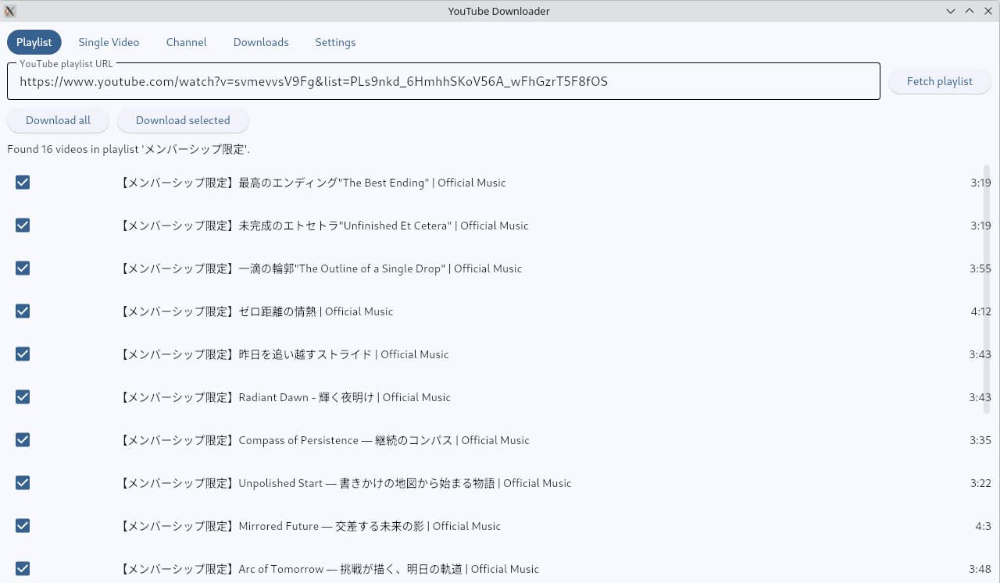
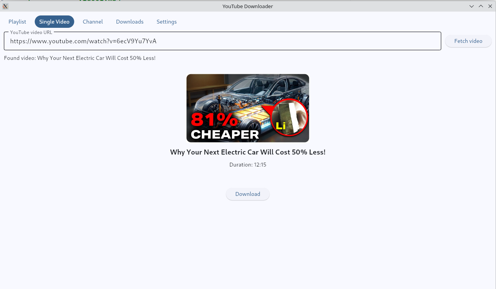
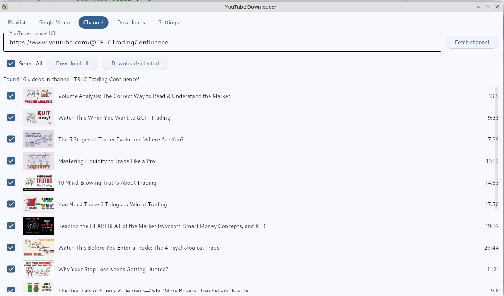
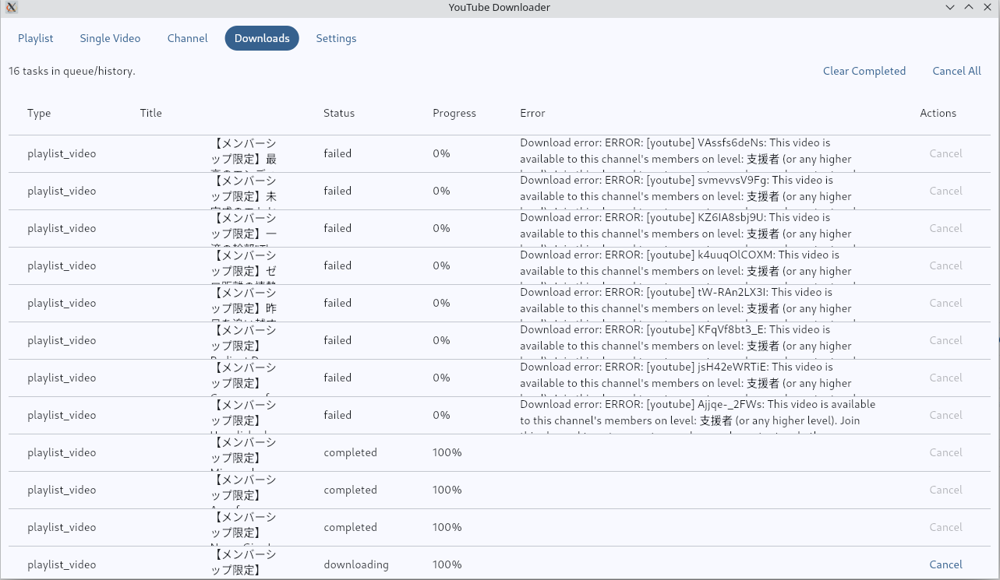
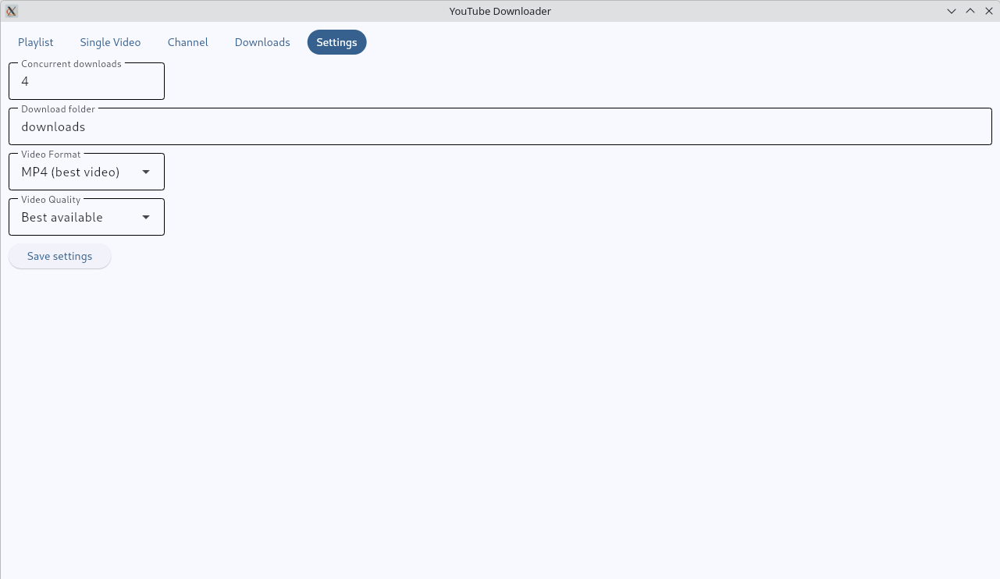

# YouTube Downloader
<a href="https://www.buymeacoffee.com/kalvinkalvink" target="_blank"></a>

A GUI application for downloading YouTube videos, playlists, and channel videos. Built with [Flet](https://flet.dev/) (Python UI framework) and [yt-dlp](https://github.com/yt-dlp/yt-dlp).

[](https://github.com/kalvinkalvink/youtube-downloader/stargazers)
[](https://www.python.org/)
[](https://github.com/kalvinkalvink/youtube-downloader/blob/main/LICENSE)

## Features

- Download single videos, playlists, and channel videos
- Configurable video format (MP4, WebM, MP3, M4A)
- Configurable video quality (Best, 1080p, 720p, 480p, Audio only)
- Concurrent downloads support
- Download queue with real-time progress tracking
- Cancel individual downloads or cancel all at once
- Clear completed downloads from queue
- Auto-organized folder structure by download type


## Install UV
[Official UV Installation Guide](https://docs.astral.sh/uv/getting-started/installation/)

## Clone repo
```bash
# Clone the repository
git clone https://github.com/kalvinkalvink/youtube-downloader.git
cd youtube-downloader
```

## Sync dependency
```bash
uv sync
```

## Requirements

- Python 3.12 or higher
- [yt-dlp](https://github.com/yt-dlp/yt-dlp) (must be installed and on PATH)

## Usage

```bash
uv run python main.py
```


## Download Folder Structure

Downloads are automatically organized by type:

```
downloads/
├── playlist/
│   └── Playlist Name/
│       ├── video1.mp4
│       └── video2.mp4
├── channel/
│   └── Channel Name/
│       └── video1.mp4
└── single/
    ├── video1.mp4
    └── video2.mp4
```

## Program Screenshots

*Playlist Video Download Tab*


*Single Video Download Tab*


*Channel Video Download Tab*


*Download Manager*



*Settings*



## Configuration

Access the Settings tab to configure:

| Setting | Description | Default |
|---------|-------------|---------|
| Download folder | Where videos are saved | `downloads` |
| Concurrent downloads | Number of simultaneous downloads | `3` |
| Video format | Output format (MP4, WebM, MP3, M4A) | `mp4` |
| Video quality | Resolution preference (Best, 1080p, 720p, 480p, Audio only) | `best` |


## Build
### Window
```bash
flet build windows
```
### Linux
```bash
flet build linux
```
### MacOS
```bash
flet build macos
```